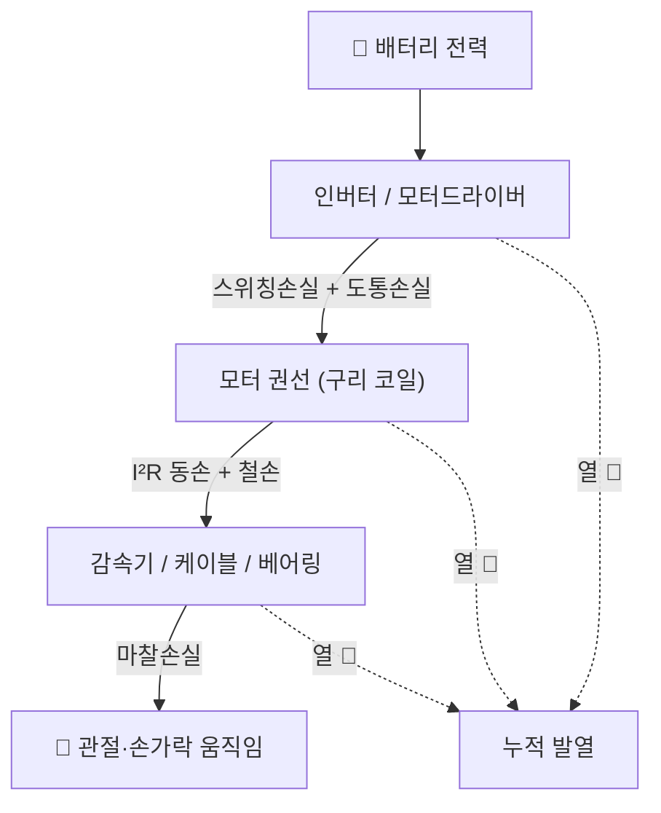
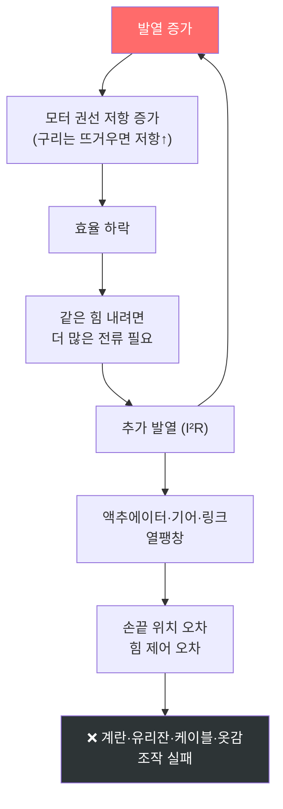
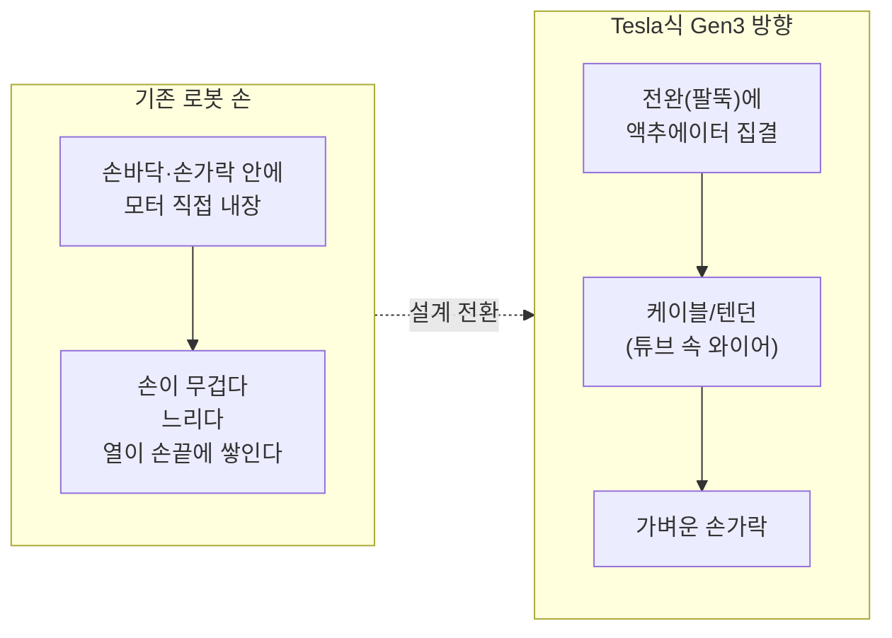
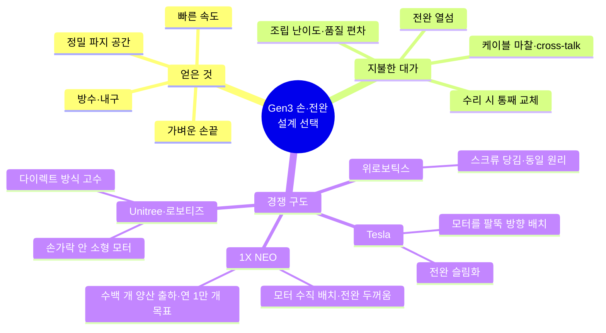
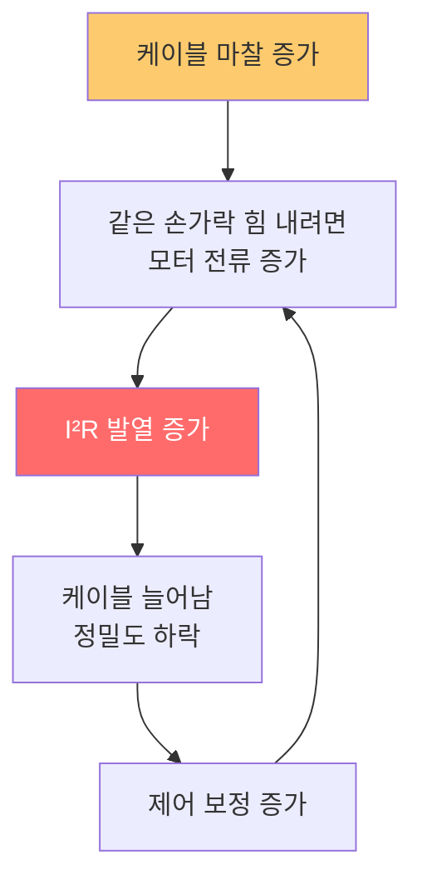
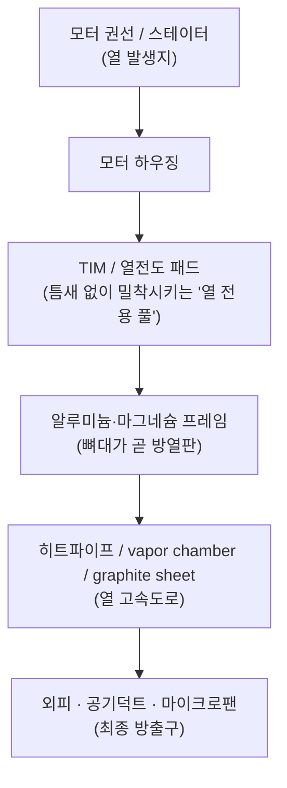
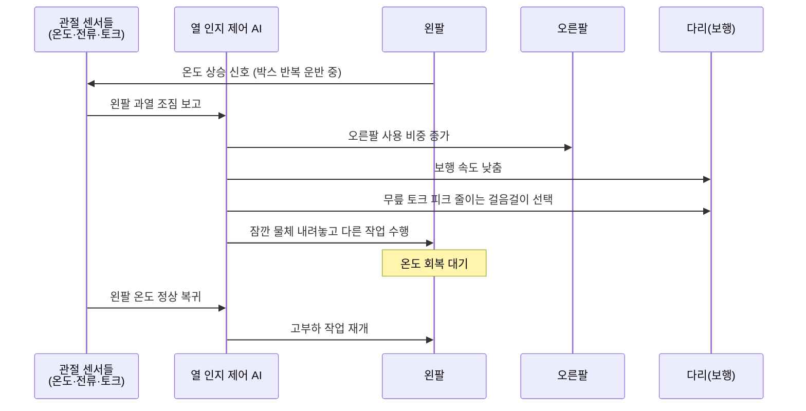
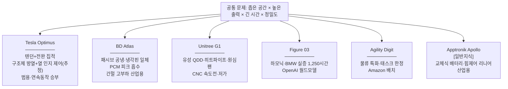
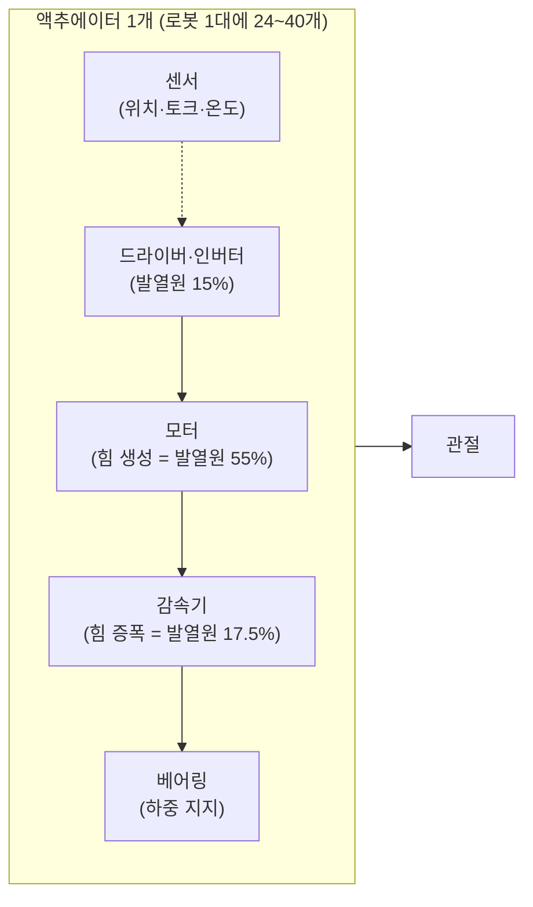
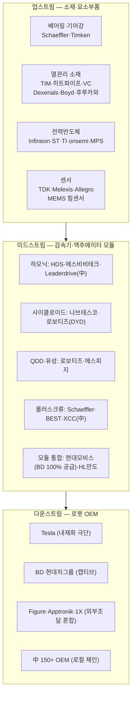

# Optimus Gen3 열관리 스토리 — "로봇이 뜨거워지면 왜 주가가 움직이는가"

> 작성일: 2026-07-12
> 원문: [tesla_optimus_gen3_thermal_management_analysis_kr.md](tesla_optimus_gen3_thermal_management_analysis_kr.md) (2026-07-10)
> 보조 소스: 휴머노이드 대시보드(components/competition/kr_valuechain/data.js) · Monroe×Schaeffler Unitree G1 분해 영상 · 1X NEO 텐던 핸드 영상 · VLA Force·Tactile 리뷰 영상
> 성격: 원문 리포트를 스토리라인으로 재구성한 해설 문서. 수치는 원문·대시보드 값을 그대로 인용 (자체추정 포함)

---

## 프롤로그 — 이 이야기의 한 줄 요약

**Optimus Gen3의 열관리 병목은 "뜨거운 로봇을 식히는 문제"가 아니라, 인간 손 수준의 정밀도와 8시간 노동 지구력을 동시에 만족시키기 위한 액추에이터·전력전자·소재·AI 제어의 통합 문제다.** (원문 §11)

비유로 시작하면 이렇다.

> 스마트폰으로 고사양 게임을 30분 하면 폰이 뜨거워지고, 폰은 스스로 화면 밝기를 낮추고 프레임을 떨어뜨린다(스로틀링). 게임이 "안 되는" 게 아니라 "느려지고 부정확해지는" 것이다.
> 휴머노이드도 똑같다. 10분 시연은 누구나 한다. 문제는 **8시간 근무**다. 8시간째의 로봇이 1시간째의 로봇과 같은 속도·같은 정밀도로 일할 수 있는가 — 이것이 Gen3의 진짜 시험이다.

전체 스토리는 6막이다.


---

## 0. 들어가기 전 — 대시보드 교차검증 결과

휴머노이드 대시보드를 최신화(`git fetch` + ff-merge, 최신 커밋 `a90ebf7`)해 확인한 결과:

- **원문 리포트는 이미 대시보드에 반영 완료.** 최신 커밋이 바로 "Optimus Gen3 양산 전환·열관리 아키텍처 갱신(구조체 방열·열 인지 제어)·부위별 열병목 판단표 신설"이며, components.html 열관리 섹션에 판단표 6개 부위·열팽창 콜아웃(70µm vs 80µm)·4종 패키지 결론까지 원문과 일치하게 들어가 있음.
- 대시보드에는 원문에 없는 **정량 보강치**가 있음: 입력 에너지의 ~90%가 열로 변환, 과열 시 최대 출력토크 30%+ 감소, 10°C 상승마다 열노화 속도 ~2배, 발열원 분해 모터권선 55%/감속기 17.5%/드라이버 15% [대시보드·자체추정]. 이 문서에 함께 인용함.
- **양산 전환 뉴스 반영**: 6월 말 임원회의 설계 승인, 공급사 조달 지침 9월 주 1,000대 → 연말 주 2,000~2,500대. 단 "연 10만 대"는 공급사 추산 연환산이지 Tesla 공식 목표 아님 [대시보드].
- 비교 기업 스펙(radarOEM): Optimus Gen2·Figure 03·BD Atlas·Agility Digit·Unitree G1·1X Neo 수록. **Apptronik은 대시보드 미수록** — 6막의 Apptronik 서술은 일반지식 기반이며 별도 표기함.

---

## 1막 — 열은 어디서 오는가 (기술 원리)

### 1-1. 로봇의 몸속 전기 여행

로봇이 팔을 한 번 드는 순간, 전기는 이런 경로를 여행한다. (원문 §2)



각 단계를 일상어로 풀면:

- **인버터** = 수도꼭지를 초당 수만 번 여닫는 장치. 배터리의 직류 전기를 모터가 쓸 수 있는 형태로 잘게 썰어 보낸다. 여닫을 때마다 아주 조금씩 열이 샌다(스위칭 손실).
- **모터 권선** = 전기 히터와 원리가 같다. 구리선에 전류가 흐르면 반드시 열이 난다. 헤어드라이어가 뜨거운 이유와 동일하다.
- **감속기·케이블·베어링** = 손바닥을 빠르게 비비면 뜨거워지는 것. 기계 부품이 맞물려 돌면 마찰열이 난다.

대시보드 정량치로 보면 이 여행의 결말은 충격적이다: **입력 에너지의 약 90%가 최종적으로 열이 된다** [대시보드·자체추정]. 발열원 분해는 모터권선 55% / 감속기 17.5% / 드라이버 15%. 즉 로봇은 "일하는 기계"라기보다 "일을 조금 하는 난로"에 가깝다.

### 1-2. I²R — 이 이야기 전체를 지배하는 공식

```text
발열 ∝ 전류² × 저항        (원문 §2)

전류가 2배가 되면 → 발열은 4배
전류가 3배가 되면 → 발열은 9배
```

수도관 비유: 같은 굵기의 관에 물을 2배 빨리 흘리면 마찰 소음과 진동은 2배가 아니라 훨씬 크게 늘어난다. 전기도 같다. **무거운 걸 들수록(=전류가 클수록) 열은 제곱으로 커진다.**

그래서 가벼운 물체를 잠깐 잡는 시연에서는 문제가 안 보이다가, 아래 작업이 반복되면 발열이 급격히 커진다. (원문 §2, 생략 없이 전체)

- 무거운 박스 운반
- 계단 또는 경사면 보행
- 빠른 보행
- 쟁반 균형 유지
- 물체를 오래 들고 있기
- 손가락 반복 조작
- 공장 라인의 반복 동작
- 8시간 연속 작업

특히 "물체를 오래 들고 있기"가 함정이다. 사람도 5kg 아령을 드는 건 쉽지만 **들고 가만히 서 있는 건** 힘들다. 움직임이 없어도 모터는 계속 전류를 흘려 버텨야 하고, 그동안 I²R 열은 계속 쌓인다.

---

## 2막 — 열이 왜 '정밀도' 문제인가 (문제의 본질)

### 2-1. 죽음의 나선: 발열 → 오차 → 더 큰 발열

휴머노이드에서 열은 "뜨겁다"로 끝나지 않는다. **정밀도·제어성·수명 문제로 번진다.** (원문 §3)



A→B→C→D→E→A 가 **양성 피드백 루프(악순환)** 인 게 핵심이다. 뜨거워질수록 더 뜨거워질 이유가 생긴다. 대시보드 정량치: 과열 시 최대 출력토크 30%+ 감소, 온도 10°C 상승마다 부품 열노화 속도 약 2배 [대시보드·자체추정].

### 2-2. 70µm — 열팽창이 정밀도 목표를 통째로 잡아먹는 계산

여름철 기찻길 이음새에 틈을 두는 이유: 철이 더위에 늘어나기 때문이다. 로봇 팔도 금속이다.

```text
알루미늄 부품 100mm  +  온도 30°C 상승
        ↓
열팽창 ≈ 70µm (0.07mm)                    (원문 §3)

Gen3 손끝 정밀도 목표 = 0.08mm (80µm)
        ↓
열팽창 하나만으로 오차 예산의 거의 전부를 소진
```

플라스틱 자를 뜨거운 물에 담갔다 꺼내서 길이를 재는 것과 같다 — **자 자체가 늘어났는데 눈금을 믿을 수 있나?** Gen3의 손 목표가 22 자유도·촉각센서·섬세한 파지·0.08mm 정밀도라면, 열팽창은 사소한 부작용이 아니라 목표 그 자체를 위협하는 1급 변수다.

그래서 원문(§3)은 "모터를 잘 만드는 것만으로는 부족하다"며 필요한 조합 7가지를 제시한다.

1. 고효율 모터 · 2. 저마찰 감속기 · 3. 케이블 라우팅 최적화 · 4. 전완 구조체 방열 · 5. 온도센서 기반 보정 · 6. AI 제어에서 thermal state 반영 · 7. 반복 작업 중 부하 분산

### 2-3. 곁가지 — 촉각도 같은 이유로 필요하다 [VLA 영상]

VLA(Vision-Language-Action) 리뷰 영상이 정확히 같은 지점을 짚는다: 카메라로 보면 핀이 구멍에 잘 들어가는 것처럼 보여도, 실제로는 1mm 어긋나 벽에 걸려 큰 힘이 걸리고 있을 수 있다. 그래서 ForceVLA(6축 힘센서를 토큰으로 투입)·Tactile-VLA(위치+힘 하이브리드 제어)·VLA-Touch(촉각을 언어로 번역해 플래너에 공급) 같은 연구가 나온다. **열 인지 제어(5막)와 촉각 인지 제어는 같은 사상 — "카메라 밖의 물리량을 AI에게 먹여라" — 의 쌍둥이다.** 이 흐름이 원문 §8-6(센서 투자)의 기술적 배경이다.

---

## 3막 — 테슬라의 선택: 손을 비우고 팔뚝을 채우다 (설계 의도)

### 3-1. 텐던(힘줄) 구동 — 마리오네트 인형과 낚시릴

사람 손가락에는 근육이 거의 없다. 손가락을 굽히는 근육은 **팔뚝(전완)** 에 있고, 힘줄이라는 끈이 손가락까지 힘을 배달한다. 손등에 힘을 주면 팔뚝이 꿈틀하는 이유다.

Tesla Gen3(그리고 1X NEO)는 이 구조를 베꼈다. (원문 §1, §5-1)



작동 원리는 **낚시릴**이다 [Monroe/1X 영상]. 릴을 감으면 줄이 당겨지고(손가락 굽힘), 풀면 풀린다(손가락 폄). 줄엔 항상 텐션이 걸려 있어 손끝까지 즉각 반응한다. 원문 스크립트 기준 Gen3는 **전완 하나에 선형 액추에이터 25개 — 손 담당 23개 + 손목 담당 2개**.

### 3-2. 왜 이 방식인가 — 장점 (원문 §1·§5-1 전체)

- 손이 가벼워짐 → 손끝 관성↓ → 빠른 움직임 가능
- 인간 손처럼 전완 근육이 힘줄로 손가락을 제어하는 구조와 유사
- 손 안에 전자부품·모터가 없으니 충격·방수·내구 설계가 쉬움 (1X NEO는 손 씻기 가능한 방수 장갑 시연 [1X 영상])
- 촉각센서와 손가락 구조를 더 정밀하게 설계할 공간 확보

1X NEO 영상의 실증: 손가락당 와이어 ~4개×4손가락+엄지 구조, 손 25 자유도(완전구동 22+손목 3), 텐던 내구 200만 회 테스트, 역구동(잡은 물체가 밀면 손가락이 순응) 가능, 감자칩·계란 급 정밀 파지. 위로보틱스(舊 이림)도 동일 원리(스크류로 당김/풀림)로 수건 집기·캔 따기·망치질 시연 — **텐던은 약하지 않다. 쥐는 힘은 오히려 강하다. 문제는 "일정함"이다** [1X/위로보틱스 영상].

### 3-3. 그런데 공짜가 아니다 — 단점 (원문 §1 전체)

- 전완 내부에 액추에이터 밀집 — 모터·감속기·케이블·센서·인버터가 한 공간에
- **열밀도 상승** → 전완이 "열섬(heat island)"이 됨
- 케이블 마찰과 cross-talk(한 손가락 당길 때 옆 케이블이 간섭)가 발열·정밀도 저하로 연결
- 장시간 반복 작업에서 성능 저하 가능성
- 조립 난이도: 힘줄을 일일이 끼우고 장력을 맞추는 숙련 공정 → 사람마다 품질 편차, 대량생산 시 품질 보증이 어려움 [1X/오르카 영상]
- 파손 시 손만이 아니라 **팔뚝까지 통째 교체** — 대시보드 원가 비교: 로보티즈 방식은 핑거 1개 18만원 교체 vs 텐던은 통째 교체 [대시보드]

그리고 중요한 교정 하나 [1X 영상]: **텐던이라고 사람 손과 같은 게 아니다.** 사람 힘줄은 근육·소재 자체가 수축·팽창하지만 로봇은 여전히 "모터가 줄을 감는" 방식이다. 모터 방식으로 사람 손을 똑같이 만드는 건 불가능하고, 인공근육·특수소재가 나와야 다음 단계로 간다. "V3 손 = 사람 손"으로 받아들이면 안 된다.

### 3-4. 설계 사상의 지도



모터 배치의 디테일도 갈린다 [1X/Monroe 영상]: 1X NEO는 모터를 전완 안쪽에 수직으로 심어 팔뚝이 굵어지는 대신 폭을 줄였고, Tesla는 모터 회전축을 팔뚝 방향과 나란히 눕혀 전완을 얇게 만들었다. 같은 텐던이라도 "열원을 어떻게 배열하느냐"가 이미 열관리 설계다.

---

## 4막 — 부위별 열병목 지도 (어디가 가장 뜨거운가)

### 4-1. 로봇 전신 열 지도

```text
                  [머리·목]  카메라·센서 ── 병목 낮음
                     │
      [어깨 8/10] ──┼── [어깨 8/10]     ★ 별표 = 열 인지 제어 개입 지점
         │           │          │
      [팔꿈치]    [몸통 6/10]  [팔꿈치]
         │       배터리·BMS·     │
   ┌─────┴────┐  AI컴퓨트(6/10) ┌┴─────────┐
   │ 전완 9/10 │      │         │ 전완 9/10 │  ◀◀ 최대 병목
   │ 액추 25개 │      │         │ 액추 25개 │     "고집적 액추에이터 모듈
   │ 손 23+손목2│     │         │           │      + 열관리 모듈"
   └─────┬────┘      │         └┬──────────┘
       [손 4/10]  [엉덩이 8/10]  [손 4/10]
       촉각센서      │
                 [무릎 8/10]  ← 보행·하중 고토크 연속부하
                     │
                 [발목]
              [인버터·PCBA 7/10 — 각 관절에 분산]
```

### 4-2. 판단표 원본 (원문 §1·§7 통합, 생략 없이)

| 부위 | 병목 가능성 | 이유 | Tesla 개선 방향 추정 |
|---|---:|---|---|
| 손/전완 액추에이터 묶음 | **9/10 (매우 높음)** | 전완에 다수 액추에이터 집중, 손목 케이블 마찰, 반복 파지 | 액추에이터 전완 배치, 케이블 라우팅 개선, 구조 방열, 온도센서 기반 제어 |
| 무릎·엉덩이·어깨 고토크 | 8/10 (높음) | 보행·물체 운반 시 고토크, 연속부하 | 고효율 모터, 감속기 효율 개선, 열 인지 gait control |
| 소형 고출력 인버터·PCBA | 7/10 (높음) | 작은 공간에서 고전류 스위칭, 방열 면적 부족 | 저손실 MOSFET/GaN, 고집적 gate driver, 구리/세라믹 방열기판 |
| 배터리팩·BMS | 6/10 (중간~높음) | 8시간 작업 목표 시 에너지밀도·발열·교체성 | 배터리 모듈 최적화, quick swap, BMS 열감시 |
| 온보드 AI 컴퓨트 | 6/10 (중간) | AI5급 온디바이스 추론 시 발열 | 몸통/등 쪽 방열, 팬/덕트, vapor chamber |
| 촉각센서·배선·하네스 | 4/10 (중간 이하) | 자체 발열 낮으나 밀폐·방수·내구와 충돌 | 하네스 축소, flex PCB, 분산 센서, 저전력 설계 |

가장 큰 병목은 **손 자체가 아니라 "전완에 몰린 손/손목 액추에이터"** — 3막의 설계 선택이 만든 필연적 결과다. 손을 가볍게 만든 대가로 팔뚝이 작은 데이터센터처럼 뜨거워졌다.

### 4-3. 왜 자동차처럼 라디에이터를 달면 안 되나 (원문 §6)

EV 모터는 크고, 냉각수 배관을 두를 수 있고, 주행풍도 쓴다. 휴머노이드는 넷 다 불가능하다.

```text
1. 작은 공간         → 사람 팔뚝 굵기 안에 모든 것
2. 높은 출력밀도      → 그 좁은 공간에서 사람만큼 힘
3. 긴 연속동작 시간   → 8시간 근무
4. 인간 수준 정밀도   → 0.08mm
   + 관절이 계속 움직임 → 냉각수 호스를 두르면 꺾이고 닳음
   + 사람 옆이라 조용해야 함 · 외피 필요 · 먼지·물·충격 내구  (원문 §5-3)
```

그래서 휴머노이드 열관리는 "EV의 축소판"이 아니라 **더 밀도 높고, 제어·정밀도와 결합된 별개의 문제**다. 대시보드는 이를 한 줄로 요약한다: *"별도 냉각 시스템 역할이 작아지는 대신 발열 억제·열전도·방열이 액추에이터 부품 자체에 내재화 → 액추에이터사가 단순 구동부품사가 아니라 열관리 부품사가 된다"* [대시보드].

---

## 5막 — 테슬라의 해법 4종 세트 (해결했나? → "개선 중")

### 5-0. 먼저, "해결"이 아니라 "개선 중"인 근거 (원문 §4 전체)

Gen3 공개 지연의 배경으로 스크립트가 거론한 검증 항목:

- 8시간 연속동작 · 액추에이터 열조절 · 배터리 지속시간 · 안전 인증 · 10,000개 부품 검증 · 손/전완 설계 난이도 · 양산 가능한 구조로의 재설계

여기에 Elon Musk가 공개 특허 설계에 대해 "이미 설계를 바꿨고, 이 버전은 실제로 작동하지 않았다"는 취지로 언급했다는 보도까지 있다. 방향은 잡았지만 **최종 양산형 열·마찰·내구 설계는 반복 개선 중**으로 보는 게 합리적이다.

한편 대시보드의 최신 업데이트(26.07 보도): 6월 말 임원회의에서 설계 승인, 공급사 조달 지침 **9월 주 1,000대 → 연말 주 2,000~2,500대**, 8월분 수백 대 선주문 발부. 단 "연 10만 대"는 공급사 자체 연환산이지 공식 목표가 아니며, 조달 지침은 조립 개시 6~8주 전에 나오는 공급망 선행지표다 [대시보드]. 즉 **"열관리 개선 중"과 "양산 전환 개시"가 동시에 진행되는 국면** — 이 긴장이 바로 투자 포인트다.

### 5-1. 해법 ① 열원 이사: 손가락 → 전완 (원문 §5-1)

3막에서 본 그 선택이다. 손끝의 열을 없앤 게 아니라 **팔뚝으로 옮긴 것**이고, 그 대가로 전완은 "고집적 액추에이터 모듈 + 열관리 모듈"이 됐다. 문제를 푼 게 아니라 풀 수 있는 자리로 옮긴 것 — 나머지 해법 3개가 그 자리에서 작동한다.

### 5-2. 해법 ② 케이블 마찰 줄이기 = 간접 열관리 (원문 §5-2 전체)

Tesla 특허에서 중요한 건 손목 라우팅이다. 전완→손 케이블 배열을 바꿔 손목 yaw/pitch 동작 중의 cable stretch·torque loss·friction·cross-talk·jerky motion·반복 사용 후 정밀도 저하를 줄인다.

왜 이게 열관리인가?



자전거 브레이크 케이블이 녹슬면 같은 제동력에 손가락 힘이 더 드는 것과 같다. 마찰 1g을 줄이면 전류가 줄고, 전류가 줄면 열이 **제곱으로** 준다. 그래서 손목 케이블 경로 개선은 기계 설계가 아니라 **발열을 줄이는 간접 열관리**다. (1X도 같은 이유로 와이어를 튜브에 넣어 마찰을 관리한다 [1X 영상].)

### 5-3. 해법 ③ 몸 자체를 방열판으로 (원문 §5-3 전체)

라디에이터를 달 수 없으니, **뼈대(프레임)와 피부(외피)를 라디에이터로 만든다.**



- **TIM(Thermal Interface Material)**: 뜨거운 냄비를 맨 식탁에 두면 접촉면 틈새 공기가 단열재 역할을 한다. TIM은 그 틈을 메우는 열전도 풀/패드.
- **히트파이프**: 노트북 CPU 식히는 그 부품. 속에 든 액체가 뜨거운 곳에서 증발(열 흡수)→찬 곳에서 응축(열 방출). 사람이 땀 흘려 체온 내리는 원리와 같다. 실제로 Unitree G1은 **무릎 모터에 히트파이프를 클램핑**해 쓴다 — "CPU 냉각 기술이 모터에 적용된 첫 사례" [Monroe 영상].
- **국소 마이크로팬**: G1은 엉덩이 관절에 원심팬 2개 + CNC로 깎은 공기 유도로(180° 회로)를 넣었다. 로봇 가까이서 들리는 소리가 이것 [Monroe 영상].

단일 냉각장치가 아니라 **구역별 분업**이다. (원문 §5-3 표 전체)

| 구역 | 주요 열원 | 가능한 열관리 방식 |
|---|---|---|
| 손/전완 | 선형 액추에이터, 케이블 마찰, 소형 인버터 | 구조체 방열, 열전도 패드, 소형 히트파이프, 온도센서 |
| 어깨/팔꿈치 | 고토크 액추에이터 | 금속 하우징 방열, 효율 높은 감속기 |
| 엉덩이/무릎/발목 | 보행·하중 지지 | 대형 액추에이터 방열, 보행 알고리즘 부하 분산 |
| 몸통 | 배터리, 컴퓨트, BMS | vapor chamber, 팬, 덕트, 배터리 열관리 |
| 머리/목 | 카메라, 센서, 일부 컴퓨트 | 저전력화, 방열 프레임 |

### 5-4. 해법 ④ 뜨거워지기 전에 소프트웨어로 피하기 (원문 §5-4 전체)

마라토너는 무릎이 아프기 시작하면 보폭을 바꾼다. 열 인지 AI 제어가 정확히 그것이다.



즉 **작업 스케줄링 자체가 열관리다.** 각 관절의 온도·전류·토크·반복부하·외부 온도·작업 강도를 보고 다음 동작을 조절한다. 하드웨어만으로 안 되는 이유이자, 원문이 "AI 제어에서 thermal state 반영"을 필수 조합에 넣은 이유다. Monroe 영상의 지적도 여기 닿는다: 커패시터·모터의 열 설계는 "고부하와 휴식이 섞인다"는 가정 위에 서 있으므로, **그 섞임을 만들어내는 게 소프트웨어의 몫**이다. 그리고 공급사는 하드웨어와 함께 **디지털 트윈(가상 부품 모델)** 을 납품해 OEM이 하드웨어 없이 시뮬레이션으로 이걸 검증하게 해야 한다 [Monroe/Schaeffler 영상].

---

## 6막 — 경쟁사 비교: 같은 문제, 다른 답안지

### 6-1. 스펙 한눈 비교 [대시보드 radarOEM]

| 항목 | Tesla Optimus (Gen2) | Figure 03 | BD Atlas | Agility Digit | Unitree G1 | 1X Neo |
|---|---|---|---|---|---|---|
| 키/무게 | 173cm/56kg | 168cm/61kg | 190cm/90kg | 175cm/65kg | 132cm/35kg | 168cm/30kg |
| 자유도(DOF) | 22 | 30 | 56 | 28 | 23 | 75 |
| 페이로드 | 9kg | 10kg | 50kg | 16kg | 2kg | 25kg |
| 배터리(h) | 2.3 | 2 | 5 | 3 | 1.5 | 2 |
| ASP(추정, $K) | 25 | 25 | 138 | 45 | 13.5 | 20 |
| 감속기 | 하모닉 | 하모닉 | 사이클로이드 | 하모닉 | 유성 | 유성 |
| 주 고객/포지션 | 자사 공장·범용 양산형 | BMW·미국 공장용 | 현대차그룹·하이엔드 산업용 | Amazon·GXO 물류 특화 | 범용·중국 저가형 | 일반 소비자·가정용 |
| 비고 | V3 26H2 양산 예정 | OpenAI World Model | RMAC 26.8 개소·30K CAPA(28E) | 캐나다 토요타 7대 | BOM 790만원·26.8 IPO | 26H2 소비자 배송 |

Apptronik(Apollo)은 대시보드 미수록. 일반지식 기준으로는 텍사스 기반, Mercedes-Benz·GXO 파트너십, 교체식 배터리와 힘 제어 중심 리니어 액추에이터 설계, NASA Valkyrie 계보의 산업용 노선 — **아래 열 아키텍처 비교에서 이 부분만 [일반지식·대시보드 미수록] 표기** 유지.

### 6-2. 열·액추에이터 아키텍처 관점의 비교



각 사의 답안을 스토리로 풀면:

- **Tesla — "8시간 범용"이라는 가장 어려운 시험지.** 목표 시장이 범용·연속 동작이라 열 문제를 정면돌파해야 한다. 답안: 구조체 방열 경로(하우징→TIM→프레임→히트파이프·VC·graphite→외피) + 열 인지 AI 제어(수냉 루프 없이 패시브 우선 추정). 리스크: 전완 열섬(선형 액추에이터 25개)·8시간 미검증·열팽창→정밀도 [대시보드 아키텍처 비교표].
- **BD Atlas — "짧고 굵게"는 열 문제가 다르다.** 제조 공장 간헐 고부하가 타깃이라 연속 8시간 열 누적 대신 피크 흡수(PCM: 양초처럼 녹으며 잠열로 열을 삼키는 물질)에 집중. 수냉 레이어 없음, 하우징 냉각핀 일체 — 경량·내구·누수 리스크 0. 대신 연속 고부하에는 한계 [대시보드]. 50kg 페이로드·냉장고를 드는 견고한 손 — 텐던 정밀 손과 정반대 철학 [1X 영상 대비].
- **Unitree G1 — 시간과 싸운 설계.** 전 관절 동일 계열 유성 QDD 스케일링, CNC 통깎이(금형 기다릴 시간에 시장 선점), 무릎 히트파이프+엉덩이 원심팬+아노다이징. "먼저 내고, 문제 겪고, 다음 세대에 고친다"는 반복 철학. DC 버스 전압 출렁임은 커패시터 보드를 빈 공간에 우겨넣어 해결 — 차세대에서 최적 배치될지가 관전 포인트 [Monroe 영상].
- **Figure 03 — 실증 시간의 힘.** BMW 스파르탄버그 11개월·누적 1,250시간·X3 3만 대 생산 기여 [대시보드]. 열관리 세부는 미공개지만, 실공장 누적 가동시간 자체가 열 내구 데이터 자산이다.
- **Agility Digit — 문제를 좁혀서 이긴다.** 물류(토트 운반) 특화라 동작 프로파일이 예측 가능 → 열 설계 여유. 16kg 페이로드·3h 배터리. Amazon·GXO 실배치 선두 [대시보드].
- **1X Neo — 열보다 안전·소프트.** 30kg 초경량·가정용이라 고부하 열 문제 자체가 작다. 대신 텐던 75 DOF로 정밀·유연 승부. 가전(SMEG 등) 연동 시연 — 가전 업계(LG·삼성)까지 판이 흔들리는 신호 [1X 영상].

**요약: 열관리 난이도는 "타깃 시장이 요구하는 연속 가동시간"에 비례한다.** 범용 8시간을 선언한 Tesla가 가장 어려운 문제를 풀고 있고, 그래서 Gen3 지연도 Tesla에서 나온다.

---

## 7막 — 액추에이터 밸류체인: 열 이야기가 돈 이야기가 되는 곳

### 7-1. 액추에이터 해부 — 부품 하나가 아니라 작은 시스템

Monroe×Schaeffler 분해 영상 기준, 액추에이터 하나 = 모터 + 감속기 + 베어링 + 센서 + 드라이버(인버터) + 하우징. Schaeffler는 이 구성으로 **휴머노이드 BOM의 50%+를 자사 기술로 커버**한다고 말한다.



### 7-2. 감속기 3형제 — 쉬운 비유로

| 방식 | 비유 | 특성 | 대표 사용처 |
|---|---|---|---|
| **하모닉(스트레인 웨이브)** | 타원형 심이 얇은 컵을 안에서 눌러 이 하나 차이로 도는 시계 태엽 | 100:1 고감속·초경량·백래시 0. 대신 **역구동 불가**, 충격에 플렉스 스플라인 파손 위험, 토크센서 필요 | Optimus·Figure·Digit 관절, 산업 로봇 |
| **유성기어 QDD** | **자동차 핸들 무게감.** 너무 무거운 핸들은 노면 느낌이 죽고, 가벼우면 노면이 손에 그대로 온다. QDD는 감속비를 낮춰(~15:1) 외부 힘을 모터가 그대로 느끼게 한 설계 | 역구동 가능·전류만으로 토크 추정(토크센서 생략)·충격에 강함. 대신 무겁고 백래시 있음 | Unitree G1 전신, 로보티즈 다이나믹셀 |
| **사이클로이드** | 하모닉보다 튼튼한 대형 태엽 | 대토크 전달. 고관절·무릎 등 고하중용 | BD Atlas (나브테스코 계열 기술) [대시보드] |

QDD의 "외부 힘을 느낀다"는 성질이 왜 중요한가 — 2막의 VLA 이야기와 연결된다. 로봇이 벽을 밀 때 저항을 느껴야 힘 조절이 되는데, 하모닉은 감속비가 높아 그 감각이 죽는다(무거운 핸들). 그래서 하모닉 쓰는 로봇은 토크센서를 따로 달고, QDD 쓰는 로봇은 전류로 때운다. **감속기 선택 = 감각기관 설계 = 제어 철학**이다 [Monroe 영상].

또 하나의 열 연결고리 [Monroe/Schaeffler 영상]: 휴머노이드용 하모닉은 산업용과 달리 **역구동성·저소음·저기동토크**로 다시 최적화해야 하고(기어 지오메트리·베어링 재설계), 유성기어 마찰열이 모터 전기열과 합쳐지면 자석이 힘을 잃는(감자) 문제 때문에 **DLC 코팅 등 저마찰 처리**가 부가가치가 된다 [대시보드]. 감속기사가 곧 열관리사인 이유.

### 7-3. 선형(리니어) 쪽 — 스크류 가문

Tesla가 전완·다리에 쓰는 선형 액추에이터의 심장은 회전을 직선으로 바꾸는 스크류다 [Monroe/Schaeffler 영상].

- **볼스크류**: 나사산에 구슬을 넣어 마찰↓. 효율 좋음. EPS(전동 조향)로 자동차에서 대량생산 이력.
- **플래니터리 롤러스크류**: 구슬 대신 작은 롤러 나사들이 감싸는 구조. 같은 크기에서 훨씬 큰 힘("펀치를 압축 포장"). 정밀 연삭이 필요해 비싸다.
- **인버티드(역전) 방식**: 너트가 돌고 축이 직진 — 패키징이 극도로 타이트할 때. 안쪽 나사산을 연삭 휠로 파야 해서 **부품 하나에 연삭 몇 분~20분** — 이게 다 원가다.

Schaeffler의 핵심 주장: EPS 볼스크류가 그랬듯 **연삭 정밀부품 → 전조(rolling)·최적화 양산품**으로 바뀌면, 액추에이터 대당 **$1,000 → $100** 급의 원가 곡선이 가능하다. 로봇 1대에 24개 이상 들어가므로 이 곡선이 곧 로봇 가격 곡선이다. Schaeffler 슬라이드의 전망도 같은 그림: **2030년까지 판매량 ×30, BOM 원가 -30%** [Schaeffler 자료].

힘 센서도 같은 문법 [Monroe 영상]: 산업용 로드셀 대신 **디젤 압력센서용 MEMS 다이어프램**을 힘 측정에 전용 — 연 수백만 개 찍던 자동차 라인을 그대로 활용해 원가를 수 분의 1로. **"자동차 스케일의 문법을 로봇에 이식하는 자가 원가를 지배한다."**

### 7-4. 밸류체인 지도 — 누가 어디에 서 있나



**한국 체인의 자리** [대시보드 kr_valuechain]:

- **현대모비스** — BD Atlas 액추에이터 부품 100% 공급 공식화(JPM 2026), 2028 1차 목표 35만 개(Atlas 11,000대분), 이후 Hand Actuator 이관→액추에이터+센서+제어기 융합 공급. 대시보드 판정 "최대 수혜."
- **에스비비테크** — 국내 하모닉 1위(日 HDS 독점 국산화), 26.3 천안 액추에이터 전용공장(수직계열화), 가동률 ~10%→풀가동 시 CAPA 10배 여력(IR), 현대차 MobED 구동기 26년 양산.
- **로보티즈** — 사이클로이드(DYD)·유성 QDD 하이브리드, 다이나믹셀=ROS 사실상 표준, 로봇손(핑거 18만원 단품 교체 구조 — 텐던 통째 교체와 대비), 우즈벡 신공장 26.4Q.
- **에스피지** — 유성감속기 QDD, 26 상반기 SDD 양산 연 5천대 목표, LG 협력.
- **HL만도**(BD Spot·2028 휴머노이드 원년) · **계양전기**(MobED 대당 12개) 등.

**중국 체인** [Schaeffler 자료]: 휴머노이드 OEM 150+개. 하모닉 Shuanghuan·Leaderdrive, 롤러스크류 BEST·XCC·Hengli, 베어링 Shuanglin·C&U, 토크센서 SRI-X·KELI, 비전 ORBBEC, 칩 Huawei·Horizon·Cambricon까지 전 층위 로컬 완결. 원문 §8-1이 "중국 업체 가격경쟁"을 감속기 리스크 1순위로 꼽은 근거가 이 그림이다.

### 7-5. 원문 §8 투자 카테고리 6종 (생략 없이)

| 카테고리 | 핵심 기술 | 관심 기업 예시 (원문) | 투자 포인트 | 리스크 |
|---|---|---|---|---|
| **8-1 정밀 감속기** | 하모닉/사이클로이드 | Harmonic Drive Systems, Nabtesco, Leaderdrive | 열 적고 백래시 낮은 감속기 = 효율·정밀도 직결 | Tesla 내재화, 중국 가격경쟁 |
| **8-2 모터·팬·소형 구동** | BLDC·코어리스·마이크로팬·베어링 | Nidec, MinebeaMitsumi, Mabuchi | 소형·고효율·저소음은 전 로봇 공통 수요 | 범용화·ASP 하락 |
| **8-3 전력반도체** | 저전압 고전류 MOSFET·gate driver·전류센서 | Infineon, STMicro, TI, onsemi, Allegro, MPS | 작은 폼팩터 고효율 인버터 필수. **SiC 대량 채용 가능성 낮음** — 로봇 관절은 수백 kW 고전압이 아니라 저전압·고전류·소형이 본질 | Tesla 자체 설계, 다수 경쟁 |
| **8-4 열관리 소재** | TIM·graphite·VC·히트파이프·PCM | Dexerials, Panasonic, 3M, Boyd/Laird, Furukawa, Denka | 전완·관절·몸통 열을 외피·프레임으로 퍼뜨리는 소재 | 낮은 단가, 내재화 |
| **8-5 능동 냉각** | 마이크로팬·solid-state cooling·EAD/plasma | Frore Systems, YPlasma, Delta, Nidec | 얇고 조용한 냉각(AirJet류)이 몸통·밀폐 모듈 후보 | 적용 불확실, 방진·방수 검증 필요 |
| **8-6 센서** | 온도·전류·위치·TMR/Hall·토크 | TDK, Murata, Melexis, Allegro, Infineon, TI | 열 인지 제어 = 관절마다 온도+전류+토크+위치 센서 세트 필수 | 단가 하락, 경쟁 |

센서 조합의 논리 (원문 §8-6):

```text
전류센서 → 모터 부하 추정      온도센서 → 과열 위험 감지
위치센서(TMR/Hall) → 정밀 제어   토크센서 → 접촉 안정성·안전 제어
```

### 7-6. "Tesla 직접 수혜"와 "산업 수혜"를 반드시 구분하라 (원문 §9 전체)

Tesla가 내부 설계 대상으로 언급한 목록: 액추에이터, custom electric motors, tendon-driven transmission, high-precision joints/linkages, sensor suite, tactile feedback sensors, 경량 구조재, **cooling system**, power electronics, battery packs, main compute, vision cameras, neck/spine mechanism, foot design, outer skin/cladding. — 사실상 전부다.

```text
Tesla Optimus 직접 공급망          휴머노이드 산업 공통 병목
  → 정보 불확실성 높음               → 감속기·모터·센서·열관리·전력반도체
  → 내재화 리스크 큼                 → 여러 완성품 업체로 확산 가능
                                    → 산업 수혜 관점에서 더 안정적 ✅
```

특정 공급사가 Optimus 매출을 크게 가져간다고 단정하기 어렵다. **"Tesla가 무엇을 사느냐"보다 "산업 전체가 무엇에 막혀 있느냐"에 베팅하는 게 구조적으로 안전하다** — 그리고 산업 전체가 막힌 곳이 바로 이 문서의 주제, 열이다.

---

## 에필로그 — 최종 판단 (원문 §10 전체)

```text
완전 미해결 ────────── 개선 중 ────────── 양산 검증 완료
                        ▲
                 현재 공개정보상 위치
        (설계 승인·조달 지침은 나왔으나 8시간 열 검증은 미확인)
```

핵심 병목 = **손/전완 액추에이터의 열밀도 + 8시간 연속동작 검증.** 액추에이터를 손에서 전완으로 옮긴 것은 매우 좋은 방향이지만, 그 결과 전완이 작은 "열섬"이 됐다.

Gen3의 진짜 승부처는 손가락 자유도 숫자가 아니라 다음 7개 질문이다.

1. 전완 액추에이터가 장시간 반복 동작을 견디는가?
2. 손목 케이블 마찰이 충분히 낮은가?
3. 열팽창으로 손끝 정밀도가 흔들리지 않는가?
4. 고출력 인버터가 작은 공간에서 안정적으로 동작하는가?
5. 8시간 작업 중 배터리와 열관리가 동시에 가능한가?
6. 온도 상승을 AI 제어가 미리 예측하고 작업을 조절하는가?
7. 양산 후 고장률이 서비스 가능한 수준인가?

그리고 주목할 것은 단일 냉각장치가 아니라 4종 패키지다.

```text
고효율 액추에이터  +  저손실 인버터  +  구조체 방열  +  열 인지 제어 알고리즘
```

**이 네 가지를 동시에 잡는 기업이 휴머노이드 밸류체인에서 프리미엄을 받을 가능성이 크다.** (원문 §10)

스토리를 한 문단으로 닫으면 — 로봇은 전기의 90%를 열로 바꾸는 난로이고(1막), 그 열은 0.08mm 정밀도를 직접 갉아먹으며(2막), Tesla는 손을 비우고 팔뚝에 열을 모으는 도박을 했고(3막), 그래서 전완이 최대 병목이 됐으며(4막), 해법은 케이블·소재·구조·AI의 4중주이고(5막), 경쟁사들은 각자 시장에 맞춰 더 쉬운 시험지를 골랐으며(6막), 돈은 이 문제를 자동차 스케일 문법으로 푸는 부품사 — 감속기·스크류·전력반도체·열소재·센서 — 로 흐른다(7막).

---

*소스 표기: [원문] = tesla_optimus_gen3_thermal_management_analysis_kr.md · [대시보드] = humanoid-dashboard (커밋 a90ebf7 기준) · [Monroe 영상] = Monroe×Schaeffler Unitree G1 분해 · [1X 영상] = 1X NEO 텐던 핸드 해설 · [Schaeffler 자료] = GS APAC Robotics Call 슬라이드 · [일반지식] = 대시보드·제공소스 미수록 항목(Apptronik). 수치 중 자체추정 표기는 원문·대시보드 표기를 그대로 승계함.*
